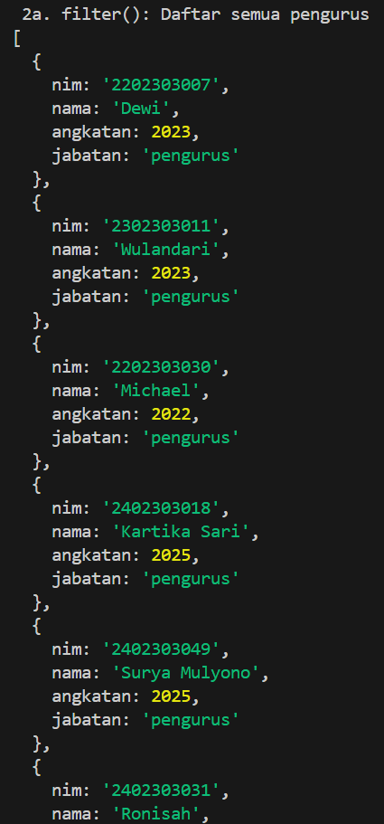
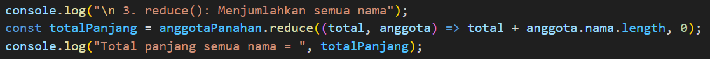
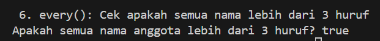

# TUGAS WEEK 5 ARRAY METHODS

## **Identitas**
Nama: Ajeng Sakinah Wulandari
NIM: F1D022001

## Deskripsi Tugas

Tugas ini bertujuan untuk mengimplementasikan beberapa metode array (`map`, `filter`, `reduce`, `find`, `some`, dan `every`) untuk sebuah kasus ringan. Dataset yang digunakan adalah dataset yang dibuat sendiri yang berisi nama anggota panahan, NIM mereka, angkatan para anggota di Panahan, serta status jabatan mereka apakah anggota atau pengurus. Tugas ini melakukan praktik untuk menganalisis dataset tersebut dengan menggunakan metode-metode tersebut secara spesifik.

## **Implementasi & Hasil**

### **1. `map()`**
- **Tujuan**: Untuk mengubah atau mentransformasikan setiap elemen dalam array. Dalam kasus ini, `map()` digunakan untuk membuat array baru yang berisi nama semua anggota dalam format huruf besar (UPPERCASE).
- **Screenshot**:

### **2. `filter()`**
- **Tujuan**: Untuk menyaring elemen array berdasarkan kondisi tertentu. `filter()` digunakan untuk mencari dan menampilkan daftar anggota yang panjang namanya lebih dari 5 huruf/karakter.
- **Screenshot**:

### **2a. `filter()`**
- **Tujuan**: Untuk menyaring elemen array berdasarkan kondisi tertentu. `filter()` digunakan untuk mencari dan menampilkan daftar anggota yang status jabatannya adalah pengurus.
- **Screenshot**:

### **3. `reduce()`**
- **Tujuan**: Untuk "mereduksi" atau menggabungkan semua elemen dalam array menjadi satu nilai tunggal. Di sini, `reduce()` digunakan untuk menghitung total panjang karakter dari semua nama anggota.
- **Screenshot**:

### **4. `find()`**
- **Tujuan**: Untuk menemukan dan mengembalikan **elemen pertama** dalam array yang memenuhi kondisi. Metode ini berhenti mencari setelah elemen ditemukan. Metode ini digunakan untuk mencari anggota pertama yang namanya diawali dengan huruf **'S'**.
- **Screenshot**:

### **4a. `find()`**
- **Tujuan**: Untuk menemukan dan mengembalikan **elemen pertama** dalam array yang memenuhi kondisi. Metode ini berhenti mencari setelah elemen ditemukan. Metode ini digunakan juga untuk mencari anggota pertama dalam daftar yang memiliki jabatan **"pengurus"**. Perbedaannya ketika menggunakan `filter()` adalah, `filter()` menampilkan list dari anggota yang merupakan pengurus, sedangkan `find()` hanya menampilkan data pertama pada dataset yang merupakan pengurus.
- **Screenshot**:

### **5. `some()`**
- **Tujuan**: Untuk memeriksa apakah **minimal ada satu** elemen dalam array yang memenuhi kondisi. Metode ini mengembalikan nilai boolean (`true` atau `false`) dan sangat efisien untuk validasi cepat. Contohnya:
    1.  Mengecek apakah ada anggota dari **angkatan 2025** (hasilnya `true`).
    2.  Mengecek apakah ada anggota dari **angkatan 2019** (hasilnya `false`).
- **Screenshot**:

### **6. `every()`**
- **Tujuan**: Untuk memeriksa apakah **semua** elemen dalam array memenuhi suatu kondisi. Metode ini juga mengembalikan nilai boolean dan berguna untuk memastikan integritas data. Di sini, `every()` digunakan untuk memvalidasi bahwa **semua nama anggota memiliki panjang lebih dari 3 huruf**.
- **Screenshot**:

## **Kesimpulan**

Setiap metode array memiliki peran spesifik yang membuat manipulasi data menjadi lebih ringkas dan mudah dibaca dibandingkan menggunakan perulangan for tradisional. Metode `map()` sangat ideal untuk melakukan transformasi pada setiap elemen, sedangkan `filter()` berfungsi untuk menyeleksi data berdasarkan kriteria tertentu. Untuk kebutuhan penggabungan semua data menjadi satu nilai tunggal bisa menggunakan `reduce()`. Lalu, `find()` sangat efisien untuk pencarian satu elemen pertama yang cocok, dan `some()` serta `every()` berperan penting dalam validasi. `some()` untuk memeriksa keberadaan 'setidaknya satu' elemen yang memenuhi syarat, dan `every()` untuk memastikan 'semuanya' memenuhi syarat.